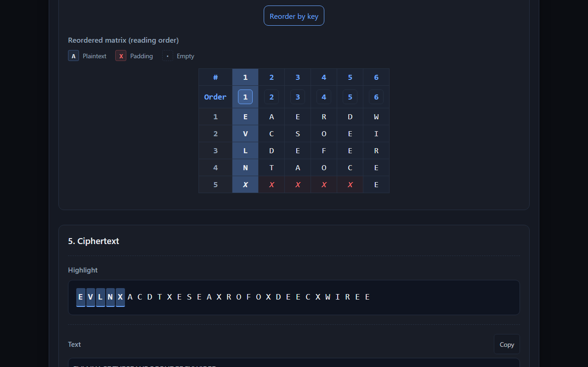
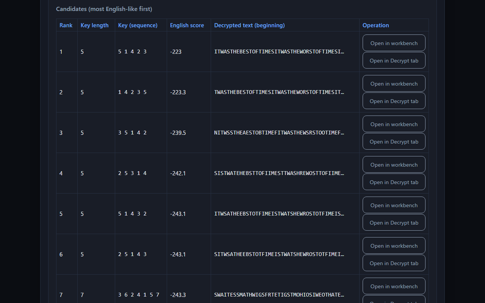
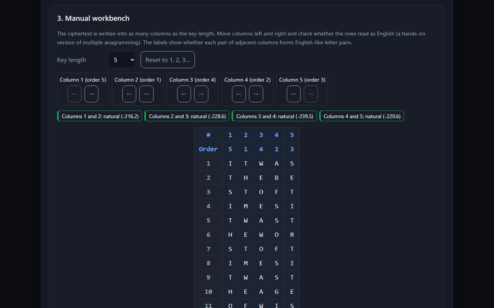

# 🔐 Columnar CipherLab - Columnar Transposition Cipher Tool

English · [日本語](README.md)


[](https://ipusiron.github.io/columnar-cipherlab/)

**Day043 - 100 Security Tools with Generative AI**

**Columnar CipherLab** is a web-based educational tool for trying encryption and decryption with the columnar transposition cipher.

The columnar transposition cipher is one of the most widely used classical transposition ciphers. The plaintext is written row by row into a rectangular matrix, the columns are reordered according to the key, and the ciphertext is read column by column.

Besides encryption and decryption, the tool offers the Myszkowski variant, double transposition, and a "cryptanalysis lab" for breaking ciphertexts with an unknown key by brute force and by hand. The screen can be switched between Japanese and English.

---

## 🌐 Demo

👉 **[https://ipusiron.github.io/columnar-cipherlab/](https://ipusiron.github.io/columnar-cipherlab/?lang=en)**

Try it directly in your browser. Nothing to install; you can follow encryption and decryption visually.

---

## 📸 Screenshots

> 
>
> *Encrypted with ZEBRAS, with the column read first selected*

> 
>
> *Brute force in the cryptanalysis lab (candidates from 46,232 orders)*

> 
>
> *The manual workbench (moving columns and checking adjacent pairs)*

The screenshots of the Japanese screen (including decryption, the light theme and double transposition) are in [README.md](README.md).

---

## ✨ Features

### Encryption and decryption

- Keyword: the column order is built from a word (e.g. ZEBRAS → Z=6, E=3, B=2, R=4, A=1, S=5). Case-insensitive
- Number sequence: the column order is given directly (e.g. 3 1 4 2 5). Full-width digits, commas and the Japanese comma are also accepted
- No key: the columns are read from the left without reordering (2 to 20 columns)
- Complete / incomplete mode: choose whether to pad the matrix to a rectangle with a padding letter
- Automatic padding removal: removes up to (columns − 1) padding letters from the end of the decrypted text and shows how many were removed
- Input validation: the buttons are enabled only for valid input. In complete mode, a ciphertext whose length is not a multiple of the column count is rejected with the reason and the lengths that would fit

### Double transposition and Myszkowski

- Double transposition tab: the ciphertext from the first key is transposed again with the second key. The matrices of both steps and the intermediate text are shown side by side. Works for both encryption and decryption (no padding)
- Myszkowski: columns with the same keyword letter are read together, row by row from the left (turn it on at the keyword field of the Encrypt and Decrypt tabs)

### Cryptanalysis lab (breaking a ciphertext with an unknown key)

- Ciphertext information: length, the possible key lengths in complete mode (divisors of the length), and a hint whether it is a transposition or a substitution (chi-squared of the letter frequencies). A link that passes the ciphertext to [Frequency Analyzer](https://ipusiron.github.io/frequency-analyzer/) (Day009)
- Brute force: tries every column order for key lengths 2 to 8 and lists 10 candidates in order of how English-like the adjacent letter pairs are. It runs in a Web Worker, so the screen does not freeze while computing
- Known word: entering a word known to be in the plaintext keeps only the candidates that contain it
- Manual workbench: move columns left and right and check how the rows read. Each pair of adjacent columns is marked natural or unnatural with text and a border. Open it from a candidate, or send the chosen key to the Decrypt tab

### Sharing and language

- Share links: "Share as a puzzle" makes a link with only the ciphertext and the mode; "Share with answer" also includes the key. The plaintext is never included. Opening the link fills in the cryptanalysis lab or the Decrypt tab
- Language: the "EN / 日本語" button at the top right. The initial language is taken from `?lang=ja|en`, then the saved choice, then the browser language

### Learning aids

- Sync: copies the ciphertext and settings from the Encrypt tab to the Decrypt tab
- Matrix view: shows the original matrix and the matrix reordered by key, coloring plaintext, padding and empty cells. Padding is identified by the cell position, so an X in the plaintext is not mistaken for padding
- Highlight: shows which column (encryption) or row (decryption) each letter belongs to. Fix the highlight with the key-order and row-number buttons, also from the keyboard
- Out-of-date notice: when an input or setting changes, the tool shows that the displayed result is from the previous run
- Warnings: when the last plaintext letter is the same as the padding letter, and when the input was truncated at 10,000 characters
- Learn tab: principle, types, history, attacks, padding ambiguity, related tools and exercises
- Sample presets: five examples for learning
- Theme: dark and light. The initial theme follows the OS setting

---

## 📖 How the columnar transposition cipher works

### 🔒 Encryption

**Example: encrypting "HELLO WORLD" with the keyword "KEY"**

#### Step 1: build the matrix and write the letters
```
Key:    K E Y
Order:  2 1 3  (alphabetical: E=1, K=2, Y=3)

    K E Y
    2 1 3
    -----
    H E L
    L O W
    O R L
    D X X  (padding)
```

#### Step 2: reorder the columns (by key)
```
    E K Y
    1 2 3
    -----
    E H L
    O L W
    R O L
    X D X
```

#### Step 3: read column by column
```
Column 1 (E): EORX
Column 2 (K): HLOD
Column 3 (Y): LWLX

Ciphertext: EORX HLOD LWLX
```

### 🔓 Decryption

Decryption reverses the steps of encryption.

#### Step 1: compute the matrix size from the ciphertext length and the key

```
Ciphertext: EORX HLOD LWLX
Key: KEY
```

`rows = ceil(ciphertext length ÷ key length) = 12 ÷ 3 = 4`

In this example the matrix has 4 rows and 3 columns, so each column is 4 letters high.

#### Step 2: build the matrix and place the letters

Cut the ciphertext into pieces of 4 letters and fill them in vertically, starting with the column whose key order is smallest.

"EORX" → column 2, "HLOD" → column 1, "LWLX" → column 3

```
Key:    K E Y
Order:  2 1 3  (alphabetical: E=1, K=2, Y=3)

    K E Y
    2 1 3
    -----
    H E L
    L O W
    O R L
    D X X
```

#### Step 3: read row by row
```
Row 1: HEL
Row 2: LOW
Row 3: ORL
Row 4: DXX

Plaintext (with padding): HEL LOW ORL DXX
```

#### Step 4: remove the padding
```
Plaintext: HEL LOW ORL D
```

The final plaintext is "HELLOWORLD".

### ⚠️ Padding ambiguity

In complete mode, if the plaintext itself ends with the padding letter, the ciphertext alone cannot tell it from padding. With the keyword "KEY" and padding X, the plaintext "FO" (F O + padding X) and the plaintext "FOX" both give the ciphertext "OFX".

The tool warns about this at encryption time and, when decrypting, shows how many padding letters were removed. There are at most (columns − 1) padding letters, so no more than that are removed.

---

## 📖 How to use the tool

### 🔒 Encrypting

1. Plaintext: enter the text to encrypt in the Encrypt tab
2. Samples: if you are new, choose a learning preset from "Samples"
3. Key: enter a keyword (e.g. ZEBRAS) or a number sequence (e.g. 3 1 4 2 5). Without a key, set the number of columns
4. Mode: complete mode (with padding) or incomplete mode
5. Formatting: choose remove spaces, remove symbols and uppercase
6. Run: the "Encrypt" button (or Enter in a key field, Ctrl+Enter in the plaintext field)
7. Result: check the matrix and the ciphertext; "Reorder by key" shows the reading order

### 🔓 Decrypting

1. Ciphertext: enter the ciphertext in the Decrypt tab
2. Sync: "Use the Encrypt tab result" copies the ciphertext and settings at once
3. Key: enter the same key used for encryption
4. Mode: choose the same complete or incomplete mode used for encryption
5. Spaces: to remove grouping spaces and line breaks, turn on "Ignore spaces and line breaks in the ciphertext" (turn it off if spaces were encrypted too)
6. Run: the "Decrypt" button
7. Result: check the decryption matrix and the recovered plaintext

### 🧩 Double transposition

1. In the "Double transposition" tab, choose "Encrypt" or "Decrypt"
2. Enter the text, the first key and the second key (keywords or number sequences)
3. Press "Run". "Wikipedia example" fills in the known example (ZEBRAS → STRIPE)

### 🔍 Cryptanalysis lab

1. Enter a ciphertext in the "Cryptanalysis lab" tab ("Example" fills in a practice ciphertext)
2. Check the length, the possible key lengths and the transposition/substitution hint
3. Choose the key length range and press "Run brute force". For a short ciphertext, enter a word you know in "Known word" to narrow the candidates
4. Check the column order of a candidate with "Open in workbench", and move columns left or right if needed
5. "Open in Decrypt tab" (or "Open in the Decrypt tab with this key" in the workbench) shows the decryption with that key

### 🔗 Making a share link

1. Encrypt in the Encrypt tab
2. Press "Share as a puzzle" or "Share with answer". The link is copied to the clipboard and shown in the field
3. When the recipient opens the link, the ciphertext and settings are filled in: in the cryptanalysis lab for a puzzle, or in the Decrypt tab with the answer

### ⚙️ Formatting options

| Option | Effect |
|---|---|
| Remove spaces | Removes white space (including full-width spaces, line breaks and tabs) |
| Remove symbols | Removes punctuation, symbols and underscores. Letters (including Japanese and accented letters) and digits are kept |
| Uppercase | Converts letters to uppercase |

Each cell holds one character (one Unicode code point). Japanese text can be transposed too.

---

## 🎓 Sample presets for learning

The tool includes several sample presets for learning.

| Sample | Plaintext | Key | Ciphertext (complete mode, padding X) |
|---|---|---|---|
| ① Mother Goose | Who killed Cock Robin? I, said the Sparrow, | MOTHER | IOIDAXKCBIPXWLKIHRHERSEOLCNTRXODOASW |
| ② ZEBRAS | WE ARE DISCOVERED FLEE AT ONCE | ZEBRAS | EVLNXACDTXESEAXROFOXDEECXWIREE |
| ③ ATTACK AT DAWN | ATTACK AT DAWN | 3 1 4 2 5 | TANADXAKWTTXCAX |
| ④ Alberti, father of cryptography | CRYPTOGRAPHY IS THE HEART OF SECURITY | ALBERTI | CRTTRYPEFTPHHSYGSRUXRAHOITYEEXOIACX |
| ⑤ HELLO WORLD | HELLO WORLD | 2 1 3 | EORXHLODLWLX |

These well-known examples help you understand how the columnar transposition cipher works. Sample ② uses the same plaintext and key as the example in the Wikipedia article "Transposition cipher" (the article pads with QKJEU, giving the ciphertext `EVLNE ACDTK ESEAQ ROFOJ DEECU WIREE`).

### 📥 Adding presets

Add a sample preset by editing `data/presets.json`; no code change is needed. The English screen uses `name_en` and `description_en`.

```json
{
  "id": "6",
  "name": "⑥カスタムサンプル",
  "name_en": "⑥ Custom sample",
  "description": "説明文",
  "description_en": "Description in English",
  "plaintext": "CUSTOM PLAINTEXT",
  "keyType": "keyword",
  "keyword": "SAMPLE",
  "numeric": null,
  "settings": {
    "complete": true,
    "padChar": "X",
    "stripSpace": true,
    "stripSymbol": true,
    "uppercase": true,
    "useKey": true,
    "colNum": null
  }
}
```

---

## 🎯 Use cases

### Learning security

- In an introductory cryptography course, encrypt the same plaintext with a substitution cipher (such as [Vigenere Cipher Tool](https://ipusiron.github.io/vigenere-cipher-tool/)) and with this tool, then compare the letter frequencies in [Frequency Analyzer](https://ipusiron.github.io/frequency-analyzer/). With transposition the frequencies stay the same as in the plaintext, which shows that reordering alone does not hide which letters are used
- When practicing CTF or cipher puzzles, check a hand-solved result in the Decrypt tab. The length rule of complete mode (a multiple of the column count) also shows how to narrow down the key length
- In the cryptanalysis lab, experience that a transposition cipher falls to nothing more than "try every column order" and "rank by English score", even without the key. Watching the right answer get buried in a short ciphertext and come back up with a known word shows how much a guessed plaintext (crib) helps
- Explain why modern block ciphers combine substitution and transposition: with transposition alone, changing one plaintext letter changes only one ciphertext letter

### Education

- In a high school or university information security class, show how a keyword determines the column order, with matrices and colors
- In a math class, use it as a concrete example of permutations (n!) and remainders: see how many times the number of orders grows when the key gets one letter longer, and that in incomplete mode "as many left columns as the remainder are one row taller"
- In a class or study group, the teacher hands out a "Share as a puzzle" link and the participants solve it by hand in the workbench. The answer is checked with a "Share with answer" link
- With the English screen and this English README, it can also be used by learners outside Japan and in classes that teach cryptography in English
- In history lessons or self-study, try it by hand together with stories of the German double transposition in World War I and the hand ciphers of the resistance in World War II

### Hobbies and creative work

- When writing puzzles for escape rooms or puzzle events, create a problem that is decrypted with a keyword hidden in the room and check that the answer is unique. To avoid the padding ambiguity, make the last plaintext letter different from the padding letter. Brute force in the cryptanalysis lab also shows whether the puzzle can be solved too easily without the key (whether it is too short)
- Japanese text can be transposed one character per cell, so you can make cipher quizzes for children or "ancient document ciphers" for board games and tabletop RPG scenarios
- Check the answers of a craft or a summer project where the text is written on squared paper, cut into columns and rearranged

### Work and research

- Puzzle magazine and quiz writers can check that the puzzle and its answer match
- In programming lessons, use it as a subject for testing that encryption and decryption round-trip (the `test/` folder of this repository has known-answer and round-trip tests)

### Combining with other tools

- [Scytale Cipher Visualizer](https://ipusiron.github.io/scytale-cipher-visualizer/) (Day010): compare the ancient transposition on a rod with transposition in a table
- [RailFence CipherLab](https://ipusiron.github.io/railfence-cipherlab/) (Day034): compare zigzag transposition with column transposition
- [Anagram Hunter](https://ipusiron.github.io/anagram-hunter/) (Day045): get a feel for anagrams, which are used when breaking transposition ciphers

This tool is for learning. The columnar transposition cipher does not meet modern security requirements, so do not use it to protect real secrets.

---

## 🗂️ Types and features of the columnar transposition cipher

### 📊 Main classifications

#### Complete vs incomplete
- Complete columnar transposition: the matrix is completed with padding letters. The ciphertext length is a multiple of the column count
- Incomplete columnar transposition: the last row is left short. As many left columns as the remainder are one row taller

#### Kinds of keys
- Keyword: the letters of a word are numbered in alphabetical order. Repeated letters are numbered from the left
- Number sequence: the column order is given directly with the numbers 1 to n
- No key: the columns are read from the left without reordering. Only the number of columns (the row length) is secret

#### Variants
- Double transposition: columnar transposition with two keys in a row (the "Double transposition" tab). Reordering both the rows and the columns of a square with the same key is called the "Nihilist transposition"
- Myszkowski: columns with the same keyword letter are read together, row by row (e.g. TOMATO → 4 3 2 1 4 3; matches the Wikipedia example `ROFOA CDTED SEEEA CWEIV RLENE`)

### ⚔️ Security properties

#### Properties
- Diffusion: spreads the positions of the letters
- Frequency preservation: the letter frequencies are the same as in the plaintext (no confusion)
- Key space: `n!` orders for n columns (40,320 for n=8)

#### Attacks
- Brute force: try every order for each key length. Practical for small key lengths
- Letter pair frequencies: reorder the columns to find the arrangement with the most natural pairs such as TH and HE
- Anagramming: arrange the columns so that a guessed word appears, and infer the key. With several ciphertexts of the same length under the same key, they can be rearranged together (multiple anagramming)

---

## 📜 Columnar transposition in the history of cryptography

### 🏛️ Antiquity
The **Spartan scytale** (around the 5th century BC) is considered the prototype of transposition ciphers. A leather strip was wound around a thin rod and the text was written on it; unwound from the rod, the letters appeared scattered.

### 🎭 Russia in the 1880s
Revolutionaries in Tsarist Russia (the Nihilists) used the "Nihilist cipher", a substitution cipher based on a Polybius square. The transposition known as the "Nihilist transposition" (reordering both the rows and the columns of a square with the same key) is described in Gaines' textbook *Cryptanalysis* (1939).

### ⚔️ World War I (1914-1918)
The German army used double transposition. Because the keys were changed infrequently, the French solved it regularly (they called it Übchi).

### 📡 World War II (1939-1945)
While cipher machines became mainstream, double transposition was used as a hand cipher by the Dutch resistance, the French Maquis and the British Special Operations Executive (SOE), among others.

### 💻 Today
Transposition alone is no longer used as a cipher, but modern block ciphers such as DES and AES repeat substitution and reordering over many rounds.

---

## ⚖️ Comparison with other classical ciphers

| Cipher | Type | Operation | Notes |
|---------|------|------|------|
| **Columnar transposition** | Transposition | Reorders letter positions | Letter frequencies are the same as in the plaintext. Broken by letter pair frequencies and anagramming |
| Caesar cipher | Substitution | Fixed shift | The most basic. Broken by trying all 25 shifts |
| Vigenère cipher | Polyalphabetic substitution | Several shifts by key | Broken by per-position frequency analysis once the key length is known |
| Rail fence | Transposition | Zigzag placement | The key is the number of rails. Letter frequencies are the same as in the plaintext |
| Playfair | Substitution | Substitutes letter pairs | Hides single-letter frequencies but is broken by pair frequencies |
| Enigma machine | Machine substitution | Substitution by rotors | Mechanical with a large key space. Broken through operating habits and known plaintext |

### 🔍 Transposition vs substitution

#### Transposition ciphers
- The kinds and numbers of letters are the same as in the plaintext (counting frequencies reveals a transposition)
- Easy to understand visually
- Can be done by hand
- Weak against anagramming

#### Substitution ciphers
- Hide which letter corresponds to which
- Monoalphabetic ciphers are broken by frequency analysis; polyalphabetic ciphers once the key length is known

---

## 🔬 Technical notes

### 🔧 Encryption algorithm
1. Preprocessing: remove spaces, remove symbols, convert to uppercase (after Unicode NFC normalization)
2. Key parsing: keyword to column order, validation of number sequences
3. Matrix: write row by row; in complete mode pad to a rectangle
4. Reading: choose the columns in key order and read each from top to bottom

### 🔓 Decryption algorithm
1. Parameters: `rows = ceil(ciphertext length ÷ columns)`
2. Column heights: in complete mode every column has `rows` letters. In incomplete mode, with `remainder = ciphertext length % columns`, the leftmost `remainder` columns have `rows` letters and the others `rows − 1`
3. Distribution: assign the ciphertext to the columns in key order
4. Reconstruction: read row by row
5. Post-processing: in complete mode remove up to (columns − 1) padding letters from the end

### 📐 Mathematical note

ceil (the ceiling function) rounds a number up to the next integer. It is used to compute the number of rows when decrypting.

```
Example: ciphertext length = 13, columns = 5
rows = ceil(13 ÷ 5) = ceil(2.6) = 3

Column heights in incomplete mode:
remainder = 13 % 5 = 3
→ the 3 leftmost columns have height 3, the other 2 have height 2
```

### 🔍 How the cryptanalysis lab works

- For each key length n, the tool decrypts with all n! column orders (46,232 in total for key lengths 2 to 8). When the length is a multiple of the key length, complete and incomplete mode give the same decryption, so it is tried only once
- English score = the average log10 probability (×100) of adjacent letter pairs. The table was built from 1,148,778 letter pairs counted in the letters-only text of *Pride and Prejudice* (#1342) and *A Tale of Two Cities* (#98) from Project Gutenberg (`js/english-stats.js`, add-one smoothing)
- Candidates that give the same plaintext are merged and the top 10 are shown. Brute force accepts up to 1,000 characters
- Checks (the tests confirm the same results as the reference implementation): in six examples of 25 to 200 characters, the right answer is always first. The 12-letter "ATTACKATDAWN" ranks 3,404th, and 12th when narrowed with the known word "DAWN"
- The transposition/substitution hint uses the same rule as [RailFence CipherLab](https://ipusiron.github.io/railfence-cipherlab/) (Day034): with 40 letters or more, a chi-squared of 80 or less against English letter frequencies means transposition

| Letters | Transposed English judged as transposition | Random substitution judged as substitution |
|---|---|---|
| 40 | 99.3% | 98.4% |
| 100 | 99.5% | 100% |
| 300 | 99.6% | 100% |
| 600 | 99.1% | 100% |
| 1,000 | 98.0% | 100% |

The values come from 2,000 excerpts each taken from *A Tale of Two Cities*. The hint can be wrong depending on the text (for example, an 80-letter transposed excerpt of the same book gave a chi-squared of 149.8, on the substitution side). The chi-squared value is shown alongside as a guide.

- The workbench labels a pair of adjacent columns natural when its average is −248 or more and unnatural when it is −258 or less. In a check with 2,000 excerpts of 6 rows × 2 columns of English, the lower quartile of correct pairs was −247 and the upper quartile of random pairs was −255

### 🧩 Relation to modern ciphers

- DES: inside the f function, the 32-bit S-box output is reordered by the permutation P (P-box)
- AES: ShiftRows rotates each row of the state by bytes, changing byte positions
- SPN structure: layers of S-boxes (nonlinear substitution) and P-layers (reordering) repeated over many rounds

Shannon (1949) called the spreading of the statistical structure of the plaintext "diffusion". With columnar transposition alone, changing one plaintext letter changes only one ciphertext letter, so on its own it gives little diffusion. Modern ciphers obtain diffusion by repeating substitution and reordering.

### 🎨 Design

- The conversion logic lives in `js/columnar-core.js` and does not depend on the screen (DOM). The tests import this module directly
- The texts shown on screen are kept in `js/messages.js`
- Presets are kept in JSON so that they are easy to extend
- CSS variables and a data attribute switch between dark and light
- Loaded as ES modules (no build step)

---

## 🧪 Tests

```bash
npm test
```

- Runs with `node --test` on Node.js 22 or later. No dependencies
- GitHub Actions runs it on every push and pull request
- Core logic: known answers of the Wikipedia ZEBRAS example and the five samples, and 1,200 round trips (10 keys × lengths 1 to 60 × complete/incomplete) checked against an independent reference implementation
- Variants: known answers of the Wikipedia Myszkowski (TOMATO) and double transposition (ZEBRAS → STRIPE) examples, and 480 Myszkowski round trips
- Cryptanalysis lab: the brute-force ranks and scores match the reference implementation; narrowing with a known word; the transposition hint; the workbench labels
- Share links: round trips, no plaintext field, and values out of range are not loaded
- Japanese/English: the keys of the two dictionaries match, the HTML texts match the dictionary, and no Japanese remains in the English texts, the Learn tab or the help
- README and Learn tab: the examples and tables in the README and the examples and exercises in the Learn tab are recomputed with the core logic
- Screen: no CSP-breaking inline scripts or style attributes, every id referenced by the scripts exists, text contrast of 4.5:1 or more in both themes, file format

---

## 🔒 Security

This tool is a static page published on GitHub Pages and does not send your text anywhere.

- Your text is inserted with `textContent` (never interpreted as HTML)
- A CSP (Content Security Policy) meta tag restricts scripts and styles to files from the same origin (no `'unsafe-inline'`)
- No external CDNs, fonts or analytics
- Debug logs are printed only with `?debug=1` in the URL, and never contain your text
- Input is truncated at 10,000 characters, and the screen says so
- Share links never contain the plaintext. The values are written after "#" in the URL, so they are not sent to the server when the link is opened. When loading, the length, mode and key are validated before use
- The "Frequency Analyzer (Day009)" link in the cryptanalysis lab passes the ciphertext in the `?text=` part of the URL (it reaches the GitHub Pages server), only when you click it
- Brute force runs in a Web Worker from the same origin (`js/solver-worker.js`)

Attack scenarios and how to check the measures are described in [SECURITY.md](SECURITY.md) (in Japanese).

---

## 📁 Directory structure

```
columnar-cipherlab/
├── .github/                # GitHub settings
│   └── workflows/          # GitHub Actions workflows
│       └── test.yml        # runs npm test on push and pull request
├── assets/                 # static resources
│   ├── favicon.svg         # site icon
│   ├── screenshot.png      # screenshot (encryption)
│   ├── en/                 # screenshots of the English screen
│   │   ├── screenshot.png  # English, encryption
│   │   ├── screenshot2.png # English, cryptanalysis lab brute force
│   │   └── screenshot3.png # English, manual workbench
│   ├── screenshot2.png     # screenshot (decryption)
│   ├── screenshot3.png     # screenshot (light theme)
│   ├── screenshot4.png     # screenshot (cryptanalysis lab brute force)
│   ├── screenshot5.png     # screenshot (manual workbench)
│   └── screenshot6.png     # screenshot (double transposition)
├── css/                    # style sheets
│   ├── base.css            # CSS variables, themes, base styles
│   ├── cipher.css          # matrix and highlight styles
│   ├── components.css      # UI components such as inputs and buttons
│   ├── layout.css          # header, tabs and card layout
│   ├── modal.css           # help dialog styles
│   └── study.css           # Learn tab styles
├── data/                   # data files
│   └── presets.json        # sample preset definitions
├── js/                     # JavaScript modules
│   ├── columnar-core.js    # formatting, key parsing, encryption, decryption (no DOM)
│   ├── columnar-solver.js  # brute force, cipher type hint, workbench scoring
│   ├── decryption.js       # Decrypt tab UI
│   ├── double.js           # Double transposition tab UI
│   ├── encryption.js       # Encrypt tab UI
│   ├── english-stats.js    # English letter pair and letter frequencies (generated)
│   ├── file-check.js       # notice shown when opened via file://
│   ├── help.js             # help dialog
│   ├── i18n.js             # Japanese/English switching
│   ├── lab.js              # Cryptanalysis lab tab UI (brute force, workbench)
│   ├── main.js             # entry point
│   ├── messages.js         # texts shown on screen
│   ├── presets.js          # loading presets
│   ├── share.js            # building and validating share links (no plaintext)
│   ├── solver-worker.js    # Web Worker that runs brute force in the background
│   ├── tabs.js             # tab switching
│   ├── theme-init.js       # applies the theme before rendering
│   ├── theme.js            # theme switching
│   └── utils.js            # shared helpers for tables, messages and copying
├── test/                   # automated tests (node --test)
│   ├── contrast.test.js    # text contrast in light and dark
│   ├── core.test.js        # known answers and round trips of the core logic
│   ├── format.test.js      # file format (line length, line count)
│   ├── html.test.js        # static checks of index.html
│   ├── i18n.test.js        # dictionaries vs HTML texts, no Japanese in English
│   ├── messages.test.js    # message keys and no hard-coded texts
│   ├── readme.test.js      # recomputes the examples in the README and Learn tab
│   ├── share.test.js       # share link round trips and validation
│   ├── solver.test.js      # brute force, cipher type hint, workbench labels
│   └── variants.test.js    # known answers and round trips of Myszkowski and double transposition
├── .gitignore              # Git ignore settings
├── .nojekyll               # tells GitHub Pages not to use Jekyll
├── CLAUDE.md               # development notes for Claude Code
├── index.html              # main HTML
├── LICENSE                 # MIT License
├── package.json            # npm test settings (no dependencies)
├── README.en.md            # this document
├── README.md               # Japanese README
└── SECURITY.md             # security notes (in Japanese)
```

---

## 💻 Requirements

- Recent Chrome, Edge, Firefox and Safari. Every feature was checked by automated browser tests on Chromium 145, Microsoft Edge 154 and Firefox 140. Safari (WebKit) and real devices have not been checked
- Brute force in the cryptanalysis lab uses a module Web Worker. In browsers without it, the work is done on the main thread in steps, one key length at a time
- Because the tool uses ES modules, it does not start in Chrome or Edge when the HTML file is opened directly (`file://`); a notice is shown at the top. In Firefox 140 every feature worked even from `file://`. To run it locally, serving it over HTTP is the reliable way

```bash
python -m http.server 8000
# open http://localhost:8000/
```

---

## 📄 License

MIT License - see [LICENSE](LICENSE) for details.

---

## 🛠️ About this tool

This tool was developed as part of the "100 Security Tools with Generative AI" project.
The project creates and publishes a variety of security-related tools over 100 days with the help of AI.

For details of the project and the other tools, see the following page (in Japanese).

🔗 [https://akademeia.info/?page_id=42163](https://akademeia.info/?page_id=42163)
