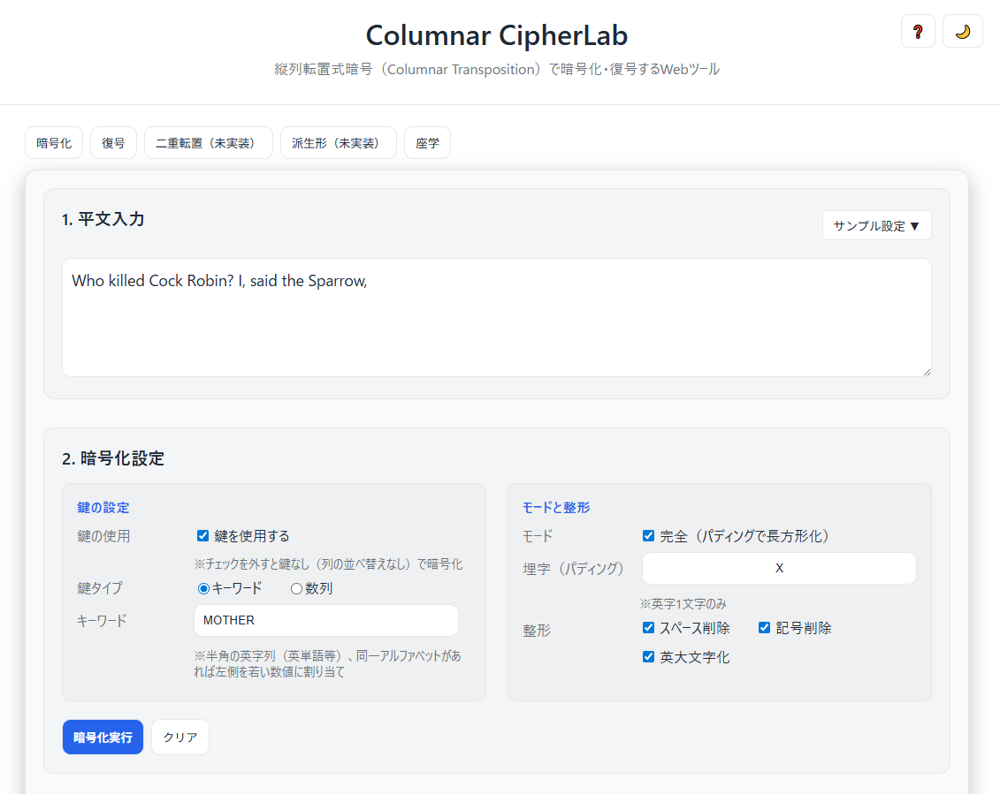

# 🔐 Columnar CipherLab - 縦列転置式暗号ツール


[](https://ipusiron.github.io/columnar-cipherlab/)

**Day043 - 生成AIで作るセキュリティツール100**

**Columnar CipherLab**は、縦列転置式暗号（Columnar Transposition Cipher）の暗号化・復号化を体験できるWebベースの教育ツールです。

縦列転置式暗号は、古典暗号の中でも広く使われている転置暗号の一種です。平文を長方形のマトリクス（表）に行方向で書き入れ、鍵に基づいて列を並べ替えてから列方向に読み出すことで暗号文を生成します。

---

## 🌐 デモページ

👉 **[https://ipusiron.github.io/columnar-cipherlab/](https://ipusiron.github.io/columnar-cipherlab/)**

ブラウザで直接お試しいただけます。インストール不要で、暗号化・復号化のプロセスを視覚的に学習できます。

---

## 📸 スクリーンショット

>   
>
> *サンプル①の暗号化*

---

## 🚀 主な機能

### ✨ 暗号化・復号化機能
- **キーワード方式**: 英単語から列順序を自動生成（例：ZEBRAS → A=1, B=2, E=3...）
- **数列方式**: 数字で列順序を直接指定（例：3 1 4 2 5）
- **完全/不完全モード**: パディング文字による長方形化の有無を選択
- **リアルタイム検証**: 入力内容に応じてボタンの有効/無効を自動制御

### 🎯 高度な機能
- **同期機能**: 暗号化タブの結果を復号タブに自動反映
- **マトリクス可視化**: 暗号化・復号過程をグリッド表示で確認
- **インタラクティブUI**: 行・列のハイライト表示で文字の対応関係を視覚化
- **コピー機能**: 結果をワンクリックでクリップボードにコピー
- **テーマ切り替え**: ダークモード・ライトモード対応

### 📚 教育機能
- **座学タブ**: 暗号の歴史・理論・攻撃手法の詳細解説
- **ヘルプシステム**: 包括的なヘルプモーダルで操作方法を説明
- **サンプルプリセット**: 学習に最適な5つの定番例を用意
- **エラーガイド**: 詳細なエラーメッセージで正しい操作を案内

---

## 📖 縦列転置式暗号の基本原理

### 🔒 暗号化プロセス

**例: 平文「HELLO WORLD」をキーワード「KEY」で暗号化**

#### ステップ1: マトリクス作成と文字配置
```
鍵: K E Y
列: 2 1 3  (アルファベット順: E=1, K=2, Y=3)

    K E Y
    2 1 3
    -----
    H E L
    L O W
    O R L
    D X X  (パディング)
```

#### ステップ2: 列の並べ替え（鍵順）
```
    E K Y
    1 2 3
    -----
    E H L
    O L W
    R O L
    X D X
```

#### ステップ3: 列方向読み出し
```
列1(E): EORX
列2(K): HLOD  
列3(Y): LWLX

暗号文: EORX HLOD LWLX
```

### 🔓 復号プロセス

復号は暗号化の逆手順で行います。

#### ステップ1: 暗号文長と鍵からマトリクスサイズを計算

```
暗号文: EORX HLOD LWLX
鍵: KEY
```

`行数 = ceil(暗号文長 ÷ 鍵長)=12÷3=4`

この例では4行3列のマトリクスを使うことになります。
つまり、各列の高さは4（4文字分）となります。

#### ステップ2: マトリクス作成と文字配置

暗号文を4文字ずつ切り出して、鍵列順が小さいところから順に、縦に埋めていきます。

「EORX」→列2、「HLOD」→列1、「LWLX」→列3

```
鍵: K E Y
列: 2 1 3  (アルファベット順: E=1, K=2, Y=3)

    K E Y
    2 1 3
    -----
    H E L
    L O W
    O R L
    D X X
```

#### ステップ4: 行方向読み出し
```
行1: HEL
行2: LOW  
行3: ORL
行4: DXX

暗号文: HEL LOW ORL DXX
```

#### ステップ5: パディング除去
```
暗号文: HEL LOW ORL D
```

最終的に得られる暗号文は"HELLOWORLD"になります。

---

## 📖 本ツールの使い方

### 🔒 暗号化手順

1. **平文入力**: 「暗号化」タブで暗号化したいテキストを入力
2. **サンプル選択**: 初心者は「サンプル設定」から学習用プリセットを選択
3. **鍵設定**:
   - **キーワード**: 英単語を入力（例：ZEBRAS）
   - **数列**: 1から始まる数字を入力（例：3 1 4 2 5）
4. **モード選択**: 完全モード（パディングあり）/不完全モード
5. **整形オプション**: スペース削除、記号削除、大文字化などを選択
6. **実行**: 「暗号化実行」ボタンで暗号化を実行
7. **結果確認**: マトリクス表示と暗号文を確認

### 🔓 復号手順

1. **暗号文入力**: 「復号」タブで暗号文を入力
2. **設定同期**: 「同期」ボタンで暗号化時の設定を自動取得
3. **鍵入力**: 暗号化時と同じ鍵を入力
4. **モード設定**: 暗号化時と同じ完全/不完全モードを選択
5. **実行**: 「復号実行」ボタンで復号を実行
6. **結果確認**: 復号マトリクスと復元された平文を確認

---

## 🎓 学習用のサンプルプリセット

本ツールでは、学習用のサンプルプリセットが複数用意されています：

- **①マザーグースの一節**: 英語童謡「Who killed Cock Robin?」+ キーワード「MOTHER」
- **②ZEBRAS**: 有名な暗号例「WE ARE DISCOVERED FLEE AT ONCE」+ キーワード「ZEBRAS」  
- **③ATTACK AT DAWN**: 軍事通信例「ATTACK AT DAWN」+ 数列鍵「3 1 4 2 5」
- **④暗号学の父アルベルティ**: 暗号学の歴史に敬意を表したサンプル
- **⑤HELLO WORLD**: プログラミング定番 + シンプルな数列「2 1 3」

これらの有名な例を通じて、縦列転置式暗号の仕組みを直感的に理解できます。

### 📥 プリセット追加

新しいサンプルプリセットは `data/presets.json` を編集するだけで追加できます：

```json
{
  "id": "6",
  "name": "⑥カスタムサンプル",
  "description": "説明文",
  "plaintext": "CUSTOM PLAINTEXT",
  "keyType": "keyword",
  "keyword": "SAMPLE",
  "numeric": null,
  "settings": {
    "complete": true,
    "padChar": "X",
    "stripSpace": true,
    "stripSymbol": true,  
    "uppercase": true,
    "useKey": true,
    "colNum": null
  }
}
```

---

## 🎯 縦列転置式暗号の種類と特徴

### 📊 主要な分類

#### **完全 vs 不完全**
- **完全縦列転置**: パディング文字で長方形マトリクスを完成させる
- **不完全縦列転置**: 最終行が欠けた状態で処理する

#### **鍵の種類**
- **キーワード方式**: 英単語をアルファベット順で数値化
- **数列方式**: 1からnまでの数列で直接列順序を指定
- **鍵なし方式**: 単純な列順読み出し（レールフェンス暗号の一種）

#### **派生形**
- **二重転置**: 縦列転置を2回適用、または縦列+横行転置

### ⚔️ セキュリティ特性

#### **強度**
- **拡散効果**: 文字位置を分散させる効果
- **頻度保存**: 文字の出現頻度は変わらない（混同効果なし）
- **鍵空間**: n列の場合`n!`通りの組み合わせ

#### **攻撃手法**
- **頻度分析**: 言語の文字頻度パターンから推測
- **アナグラム攻撃**: 部分的な単語復元から鍵を推定
- **総当たり攻撃**: 小さな鍵長では現実的

---

## 📜 暗号史における縦列転置式暗号

### 🏛️ 古代から中世
**スパルタのスキュタレー暗号**（紀元前5世紀）が転置暗号の原型とされています。細い棒に革紐を巻きつけて文字を書き、棒を外すと文字が分散される仕組みでした。

### 🎭 ルネサンス期（15-16世紀）
**レオン・バッティスタ・アルベルティ**（1404-1472）が『暗号論』で転置暗号の理論を体系化。現代暗号学の父と呼ばれる彼の功績により、転置暗号は学術的な基盤を得ました。

### 🏛️ ニヒリスト式置換法（1880年頃）
帝政ロシアの革命家ニヒリストが使用した**二重転置暗号**が有名です。獄中のミハイロフが考案したこの暗号は、縦列転置に加えて横行転置も適用する高度な方式でした。秘密警察に解読されたものの、暗号史に名を刻む事例となっています。

### ⚔️ 第一次世界大戦（1914-1918）
軍事通信で転置暗号が本格的に活用されました。ドイツ軍の**UBCHI暗号**をはじめ、複雑な鍵管理を伴う転置式暗号が戦場で重用されました。

### 📡 第二次世界大戦（1939-1945）
エニグマ暗号機などの機械式暗号が主流となる中でも、野戦部隊では簡便性から転置暗号が継続使用されました。手作業で実行できる利点が評価されていました。

### 💻 現代（20世紀後半-現在）
DESやAESなど現代ブロック暗号の内部で、**P層（置換層）** として転置の概念が活用されています。拡散機能を担う重要な要素として発展を続けています。

---

## ⚖️ 他の古典暗号との詳細比較

| 暗号方式 | 種類 | 操作 | 特徴 | セキュリティ | 実装難易度 |
|---------|------|------|------|-------------|-----------|
| **縦列転置式** | 転置 | 文字位置の並べ替え | 文字頻度保存、視覚的理解 | 中程度 | 易 |
| **シーザー暗号** | 換字 | 固定シフト | もっとも基本的、解読極めて容易 | 極低 | 極易 |
| **ヴィジュネル暗号** | 多表換字 | 鍵による複数シフト | 頻度分析に強い、鍵長が重要 | 中～高 | 中 |
| **レールフェンス** | 転置 | ジグザグ配置 | 鍵なし転置、視覚的 | 低 | 易 |
| **プレイフェア** | 換字 | 2文字組置換 | 頻度分析耐性、実用的 | 中～高 | 中 |
| **エニグマ暗号機** | 機械換字 | 回転子による換字 | 機械式、鍵空間巨大 | 高（当時） | 難 |

### 🔍 転置暗号 vs 換字暗号

#### **転置暗号の特徴**
- ✅ 文字セットが保存される（頻度分析で露見）
- ✅ 視覚的に理解しやすい
- ✅ 手作業で実行可能
- ❌ 頻度分析に脆弱
- ❌ アナグラム攻撃に弱い

#### **換字暗号の特徴**
- ✅ 文字の対応関係を隠蔽
- ✅ 多表式なら頻度分析に強い
- ❌ 鍵管理が複雑
- ❌ 単表式は頻度分析で破綻

---

## 💻 実装のポイント

### 🔧 暗号化アルゴリズム
1. **前処理**: スペース除去、大文字変換、記号除去
2. **鍵解析**: キーワード→数値変換、数列の妥当性検証
3. **マトリクス構築**: 行方向書き込み、必要に応じてパディング
4. **列並べ替え**: 鍵順に従った列の再配置
5. **読み出し**: 列方向での暗号文生成

### 🔓 復号アルゴリズム
1. **パラメーター計算**: `行数 = ceil(暗号文長 ÷ 列数)`
2. **列高決定**: 不完全モードでは `余り = 暗号文長 % 列数`
3. **文字配分**: 鍵順にしたがって暗号文を各列に分配
4. **列復元**: 元の列順序への並べ替え
5. **平文再構築**: 行方向読み出しによる平文復元
6. **後処理**: パディング文字の除去

### 📐 数学的補足

#### **ceil関数の役割**
ceil（天井関数）は小数点以下を切り上げる関数で、復号時の行数計算で重要な役割を果たします：

```
例: 暗号文長=13、列数=5の場合
行数 = ceil(13 ÷ 5) = ceil(2.6) = 3行

不完全モードでの列高分布:
余り = 13 % 5 = 3
→ 左から3列が高さ3、残り2列が高さ2
```

---

## 📂 ディレクトリ構成

```
columnar-cipherlab/
├── assets/                 # 静的リソース
│   └── favicon.svg         # サイトアイコン
├── css/                    # スタイルシート
│   ├── base.css           # CSS変数、テーマ、基本スタイル
│   ├── cipher.css         # 暗号化・復号関連スタイル
│   ├── components.css     # UIコンポーネント
│   ├── layout.css         # レイアウト構造
│   ├── modal.css          # ヘルプモーダルスタイル
│   └── study.css          # 座学タブスタイル
├── data/                   # 設定・データファイル
│   └── presets.json       # サンプルプリセット定義
├── js/                     # JavaScriptモジュール
│   ├── main.js            # エントリーポイント
│   ├── encryption.js      # 暗号化ロジック
│   ├── decryption.js      # 復号ロジック
│   ├── presets.js         # プリセット管理
│   ├── theme.js           # テーマ切り替え
│   ├── help.js            # ヘルプシステム
│   ├── tabs.js            # タブ切り替え
│   └── utils.js           # 共通ユーティリティ
├── index.html              # メインHTML
├── README.md              # プロジェクト説明
├── SECURITY.md            # セキュリティ対策技術解説
├── LICENSE                # ライセンス
└── CLAUDE.md              # Claude Code設定
```

### 🎨 設計思想

- **モジュラー構成**: 機能ごとにファイルを分離し保守性を向上
- **データ駆動**: プリセット設定をJSONで外部化し、拡張を容易化
- **テーマ対応**: CSS変数でダーク・ライトテーマを効率的に管理
- **ES6モジュール**: 現代的なJavaScript環境でモジュール間の依存関係を明確化

---

## 🔬 暗号学的考察

### 📊 現代暗号との関連

縦列転置式暗号は古典暗号でありながら、現代暗号にも深い影響を与えています：

#### **ブロック暗号での活用**
- **DES**: 32ビット右半分の並べ替えでP-boxとして使用
- **AES**: ShiftRows変換で転置の概念を活用
- **一般的なSPN構造**: S-box（非線形）+ P-box（線形転置）の組み合わせ

#### **拡散の概念**
クロード・シャノンが提唱した「拡散（Diffusion）」の典型例として：
- 1ビットの変化が出力全体に影響を与える
- 統計的な偏りを除去する効果
- 現代暗号の基礎理論を形成

### ⚠️ 現代における位置づけ

**⚠️ セキュリティ上の注意**

縦列転置式暗号は教育・研究目的には優れていますが、現代のセキュリティ要件を満たしません：

- ✅ **教育価値**: 暗号の基本概念を視覚的に理解
- ✅ **歴史的価値**: 暗号学の発展過程を学習
- ❌ **実用的セキュリティ**: 現代の攻撃手法に対して脆弱
- ❌ **推奨使用**: 実際の機密情報保護には不適合

**実用的な暗号化**: AES-256、ChaCha20、RSAなど現代暗号アルゴリズムを使用してください。

---

## 🛠️ 開発・技術情報

### ⚙️ 技術スタック

- **フロントエンド**: Vanilla JavaScript (ES6+), CSS3, HTML5
- **アーキテクチャ**: SPA（Single Page Application）
- **モジュールシステム**: ES6 Native Modules
- **テーマ**: CSS Variables + データ属性によるテーマ切り替え
- **デバッグ**: 包括的なコンソールログシステム

### 🎯 今後の開発予定

#### 🚀 短期ロードマップ
- **二重転置機能**: 縦×縦、縦×横の二重転置実装
- **操作履歴**: 暗号化・復号の履歴管理機能
- **パフォーマンス最適化**: 大容量テキストの処理改善

#### 🌟 中長期ロードマップ
- **多言語対応**: 英語・中国語・韓国語での利用
- **URLクエリ共有**: パラメーターをURLで共有可能に
- **オフライン対応**: PWA（Progressive Web App）化
- **アクセシビリティ**: WCAG 2.1準拠の改善

---

## 🛡️ セキュリティ

本ツールはGitHub Pages公開を想定し、XSS攻撃やCSP設定などのWebセキュリティ対策を実装しています。

### 🔒 実装済みセキュリティ対策

- **XSS対策**: HTMLエスケープによる安全な文字列処理
- **CSP設定**: Content Security Policyによる外部リソース制限
- **入力サニタイゼーション**: DoS攻撃防止のための入力制限
- **多層防御**: ブラウザレベルとアプリケーションレベルの組み合わせ

### 📋 詳細な技術解説

攻撃シナリオ、実装内容、テスト方法については以下をご覧ください：

👉 **[SECURITY.md - セキュリティ対策技術解説](SECURITY.md)**

---

## 📄 ライセンス

MIT License - 詳細は [LICENSE](LICENSE) をご覧ください。

---

## 🛠 このツールについて

本ツールは、「生成AIで作るセキュリティツール100」プロジェクトの一環として開発されました。  
このプロジェクトでは、AIの支援を活用しながら、セキュリティに関連するさまざまなツールを100日間にわたり制作・公開していく取り組みを行っています。

プロジェクトの詳細や他のツールについては、以下のページをご覧ください。

🔗 [https://akademeia.info/?page_id=42163](https://akademeia.info/?page_id=42163)
