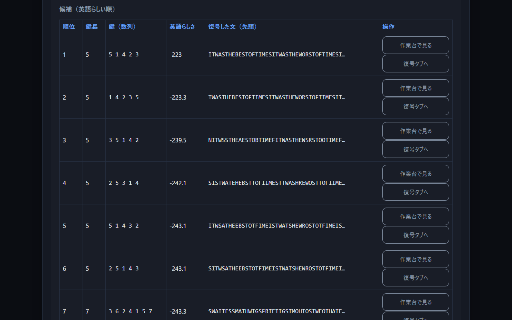
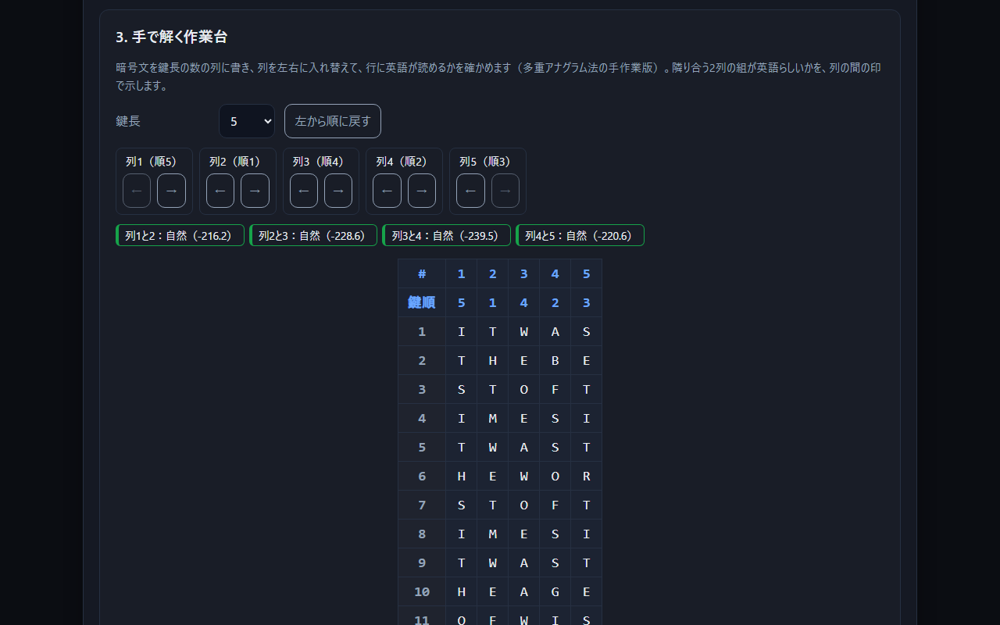
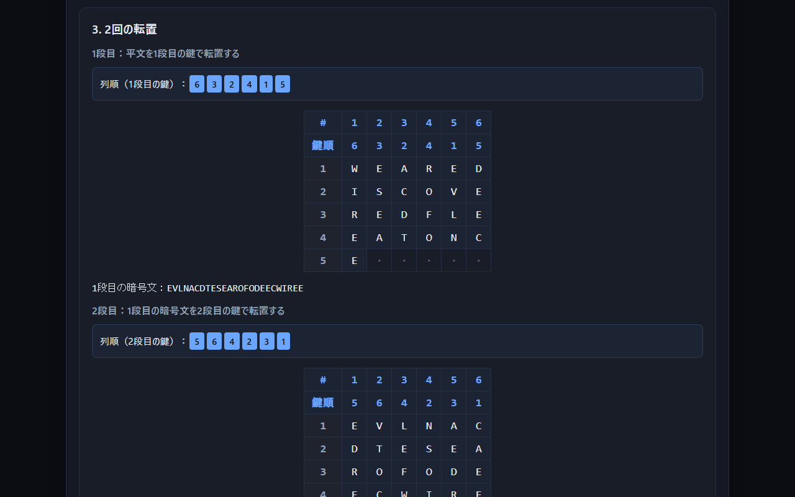

<!--
---
id: day043
slug: columnar-cipherlab

title: "Columnar CipherLab"

subtitle_ja: "縦列転置式暗号ツール"
subtitle_en: "Columnar Transposition Cipher Tool"

description_ja: "縦列転置式暗号（Columnar Transposition Cipher）の暗号化・復号を、マトリクスの可視化で学ぶ教育ツール。Myszkowski式と二重転置、鍵のわからない暗号文を総当たりと手作業で解く解読ラボ、平文を含めない共有リンク、日英の切り替えに対応。"
description_en: "An educational tool for learning columnar transposition encryption and decryption with matrix visualization. Includes the Myszkowski variant, double transposition, a cryptanalysis lab that breaks ciphertexts with an unknown key by brute force and by hand, share links without plaintext, and a Japanese/English switch."

category_ja:
  - 古典暗号
  - 転置式暗号
category_en:
  - Classical Cryptography
  - Transposition Cipher

difficulty: 1

tags:
  - columnar-transposition
  - classical-cipher
  - transposition-cipher
  - cryptography
  - visualization
  - education
  - cryptanalysis
  - double-transposition
  - myszkowski

repo_url: "https://github.com/ipusiron/columnar-cipherlab"
demo_url: "https://ipusiron.github.io/columnar-cipherlab/"

hub: true
---
-->

# 🔐 Columnar CipherLab - 縦列転置式暗号ツール

[English](README.en.md) · 日本語


[](https://ipusiron.github.io/columnar-cipherlab/)

**Day043 - 生成AIで作るセキュリティツール100**

**Columnar CipherLab**は、縦列転置式暗号（Columnar Transposition Cipher）の暗号化・復号化を体験できるWebベースの教育ツールです。

縦列転置式暗号は、古典暗号の中でも広く使われている転置暗号の一種です。平文を長方形のマトリクス（表）に行方向で書き入れ、鍵に基づいて列を並べ替えてから列方向に読み出すことで暗号文を生成します。

暗号化・復号に加えて、Myszkowski式と二重転置、鍵のわからない暗号文を総当たりと手作業で解く「解読ラボ」を備えています。画面は日本語と英語で切り替えられます。

---

## 🌐 デモページ

👉 **[https://ipusiron.github.io/columnar-cipherlab/](https://ipusiron.github.io/columnar-cipherlab/)**

ブラウザーで直接お試しいただけます。インストール不要で、暗号化・復号化のプロセスを視覚的に学習できます。

---

## 📸 スクリーンショット

> 
>
> *ZEBRASで暗号化し、読み出し順1の列を選んだ画面*

> 
>
> *復号して埋字を除き、2行目を選んだ画面*

> 
>
> *1枚目と同じ状態（ライトテーマ）*

> 
>
> *解読ラボの総当たり（46,232通りから候補を並べる）*

> 
>
> *手で解く作業台（列の入れ替えと、隣り合う列の自然さ）*

> 
>
> *二重転置（ZEBRAS→STRIPE）*

---

## ✨ 主な機能

### 暗号化・復号化

- キーワード方式：英単語から列順序を自動生成する（例：ZEBRAS → Z=6, E=3, B=2, R=4, A=1, S=5）。大文字と小文字は区別しない
- 数列方式：数字で列順序を直接指定する（例：3 1 4 2 5）。全角の数字、カンマ、読点も使える
- 鍵なし：列を並べ替えずに左から読み出す（列数2〜20）
- 完全/不完全モード：パディング文字（埋字）による長方形化の有無を選ぶ
- ランダムな英字（ヌル）で埋める：埋字に意味のない英字を使う（ブラウザーの暗号用の乱数`crypto.getRandomValues`で選ぶ）。WikipediaのZEBRASの例（ヌルにQKJEU）と同じ形
- 埋字の自動除去：復号した文の末尾の埋字を、最大「列数−1」文字まで除き、除いた数を表示する
- 入力の検証：入力に応じてボタンの有効/無効を切り替える。完全モードで長さが列数の倍数でない暗号文は、理由と合う長さを示して止める

### 二重転置・Myszkowski式

- 二重転置タブ：1段目の鍵で縦列転置した暗号文を、2段目の鍵でもう一度縦列転置する。1段目と2段目の表と途中の文を並べて見せる。暗号化と復号の両方に対応する（埋字なし）
- Myszkowski式：キーワードの同じ文字の列をまとめて、行ごとに左から読む（暗号化・復号タブのキーワードの欄でオンにする）

### 解読ラボ（鍵のわからない暗号文を解く）

- 暗号文の情報：長さ、完全モードなら考えられる鍵長（長さの約数）、転置式か換字式かの目安（英字の頻度のカイ二乗）。[Frequency Analyzer](https://ipusiron.github.io/frequency-analyzer/)（Day009）へ暗号文を渡すリンク
- 総当たり：鍵長2〜8の列の並べ方をすべて試し、英字の隣り合う2文字の組が英語らしい順に10件の候補を出す。Web Workerで動かすので、計算中も画面は止まらない
- 既知の単語：平文に入っているとわかっている単語を入れると、その単語を含む候補だけを残す
- 手で解く作業台：列を左右に入れ替えて行の読みを確かめる。隣り合う2列の組が自然か不自然かを、文字と枠の線で示す。候補から開いたり、決めた鍵で復号タブへ送ったりできる

### 共有と言語

- 共有リンク：「問題として共有」は暗号文とモードだけ、「解答つきで共有」は鍵も含めたリンクを作る。平文は含めない。開くと解読ラボか復号タブに入る
- 日英の切り替え：右上の「EN／日本語」ボタン。最初は `?lang=ja|en`、保存した選択、ブラウザーの言語の順に決める

### 学習を助ける機能

- 同期機能：暗号化タブの暗号文と設定を、復号タブにまとめて取り込む
- マトリクス可視化：元の表と鍵順に並べ替えた表を出し、平文・埋字・空セルを色分けする。埋字はマスの位置で判定するので、平文の中のXを埋字と取り違えない
- ハイライト：暗号化では列と暗号文の文字、復号では行と平文の文字の対応を色で示す。鍵順・行番号のボタンで固定でき、キーボードでも操作できる
- 結果が古いことの表示：入力や設定を変えると、表示中の結果が前回の実行のものだと知らせる
- 注意の表示：平文の最後の文字が埋字と同じとき、入力が1万文字を超えて切り詰めたときに知らせる
- 座学タブ：原理、種類、歴史、攻撃手法、埋字の曖昧さ、関連するツール、練習問題
- サンプルプリセット：学習用の5つの例
- テーマ切り替え：ダーク・ライト。最初はOSの設定に合わせる

---

## 📖 縦列転置式暗号の基本原理

### 🔒 暗号化プロセス

**例: 平文「HELLO WORLD」をキーワード「KEY」で暗号化**

#### ステップ1: マトリクス作成と文字配置
```
鍵: K E Y
列: 2 1 3  (アルファベット順: E=1, K=2, Y=3)

    K E Y
    2 1 3
    -----
    H E L
    L O W
    O R L
    D X X  (パディング)
```

#### ステップ2: 列の並べ替え（鍵順）
```
    E K Y
    1 2 3
    -----
    E H L
    O L W
    R O L
    X D X
```

#### ステップ3: 列方向読み出し
```
列1(E): EORX
列2(K): HLOD
列3(Y): LWLX

暗号文: EORX HLOD LWLX
```

### 🔓 復号プロセス

復号は暗号化の逆手順で行います。

#### ステップ1: 暗号文長と鍵からマトリクスサイズを計算

```
暗号文: EORX HLOD LWLX
鍵: KEY
```

`行数 = ceil(暗号文長 ÷ 鍵長)=12÷3=4`

この例では4行3列のマトリクスを使うことになります。
つまり、各列の高さは4（4文字分）となります。

#### ステップ2: マトリクス作成と文字配置

暗号文を4文字ずつ切り出して、鍵列順が小さいところから順に、縦に埋めていきます。

「EORX」→列2、「HLOD」→列1、「LWLX」→列3

```
鍵: K E Y
列: 2 1 3  (アルファベット順: E=1, K=2, Y=3)

    K E Y
    2 1 3
    -----
    H E L
    L O W
    O R L
    D X X
```

#### ステップ3: 行方向読み出し
```
行1: HEL
行2: LOW
行3: ORL
行4: DXX

平文（埋字つき）: HEL LOW ORL DXX
```

#### ステップ4: パディング除去
```
平文: HEL LOW ORL D
```

最終的に得られる平文は"HELLOWORLD"になります。

### ⚠️ 埋字の曖昧さ

完全モードでは、平文がもともと埋字と同じ文字で終わっていると、暗号文だけでは埋字と区別できません。キーワード「KEY」・埋字Xのとき、平文「FO」（F O ＋埋字X）と平文「FOX」は、どちらも暗号文「OFX」になります。

本ツールは、暗号化の時点でこのことを知らせ、復号では除いた埋字の数を表示します。埋字は最大でも「列数−1」文字なので、それより多くは除きません。

実際の運用では、意味のない英字（ヌル）で埋めることもあります。暗号化タブの「ランダムな英字（ヌル）で埋める」を選ぶと、埋字に乱数で選んだ英字を使い、何文字埋めたかを知らせます。ヌルは平文の末尾と区別できないので、復号のときに自動では除きません（同期や共有リンクで復号タブへ渡すと、「埋字を自動除去」は自動で外れる）。

---

## 📖 本ツールの使い方

### 🔒 暗号化手順

1. 平文入力：「暗号化」タブで暗号化したいテキストを入力
2. サンプル選択：初めての場合は「サンプル設定」から学習用プリセットを選ぶ
3. 鍵設定：キーワード（例：ZEBRAS）か数列（例：3 1 4 2 5）を入力。鍵を使わない場合は列数を指定
4. モード選択：完全モード（パディングあり）/不完全モード
5. 整形オプション：スペース削除、記号削除、英大文字化を選ぶ
6. 実行：「暗号化実行」ボタン（鍵の欄ではEnter、平文の欄ではCtrl+Enter）
7. 結果確認：マトリクスと暗号文を確認し、「鍵順に並び替え」で読み出しの順を見る

### 🔓 復号手順

1. 暗号文入力：「復号」タブで暗号文を入力
2. 設定同期：「暗号化タブの結果を同期」ボタンで、暗号文と設定をまとめて取り込める
3. 鍵入力：暗号化時と同じ鍵を入力
4. モード設定：暗号化時と同じ完全/不完全モードを選ぶ
5. 空白の扱い：区切りの空白・改行を除くなら「暗号文の空白・改行を無視」をオンにする（空白も暗号化した暗号文ではオフ）
6. 実行：「復号実行」ボタン
7. 結果確認：復号マトリクスと復元された平文を確認

### 🧩 二重転置の手順

1. 「二重転置」タブで「暗号化」か「復号」を選ぶ
2. 文を入れ、1段目の鍵と2段目の鍵を入れる（キーワードでも数列でもよい）
3. 「実行」を押す。「Wikipediaの例」で既知の例（ZEBRAS→STRIPE）を試せる

### 🔍 解読ラボの手順

1. 「解読ラボ」タブに暗号文を入れる（「例題」で練習用の暗号文が入る）
2. 長さ・考えられる鍵長・転置式か換字式かの目安を確かめる
3. 鍵長の範囲を選んで「総当たりを実行」を押す。短い暗号文では、知っている単語を「既知の単語」に入れると候補が絞れる
4. 候補の「作業台で見る」で列の並びを確かめ、必要なら列を左右に動かす
5. 「復号タブへ」（作業台では「この鍵で復号タブへ」）で、その鍵で復号した結果を見る

### 🔗 共有リンクの作り方

1. 暗号化タブで暗号化する
2. 「問題として共有」か「解答つきで共有」を押す。リンクがクリップボードにコピーされ、欄にも表示される
3. 受け取った人がリンクを開くと、問題なら解読ラボ、解答つきなら復号タブに暗号文と設定が入る

### ⚙️ 整形オプション

| オプション | 動作 |
|---|---|
| スペース削除 | 空白（全角スペース・改行・タブを含む）を除く |
| 記号削除 | 句読点・記号・アンダースコアを除く。文字（日本語やアクセント付きの文字を含む）と数字は残す |
| 英大文字化 | 英字などを大文字にする |

1マスには1文字（Unicodeのコードポイント1つ）を入れます。日本語も並べ替えられます。

---

## 🎓 学習用のサンプルプリセット

本ツールでは、学習用のサンプルプリセットが複数用意されています。

| サンプル | 平文 | 鍵 | 暗号文（完全モード・埋字X） |
|---|---|---|---|
| ①マザーグースの一節 | Who killed Cock Robin? I, said the Sparrow, | MOTHER | IOIDAXKCBIPXWLKIHRHERSEOLCNTRXODOASW |
| ②ZEBRAS | WE ARE DISCOVERED FLEE AT ONCE | ZEBRAS | EVLNXACDTXESEAXROFOXDEECXWIREE |
| ③ATTACK AT DAWN | ATTACK AT DAWN | 3 1 4 2 5 | TANADXAKWTTXCAX |
| ④暗号学の父アルベルティ | CRYPTOGRAPHY IS THE HEART OF SECURITY | ALBERTI | CRTTRYPEFTPHHSYGSRUXRAHOITYEEXOIACX |
| ⑤HELLO WORLD | HELLO WORLD | 2 1 3 | EORXHLODLWLX |

これらの有名な例を通じて、縦列転置式暗号の仕組みを直感的に理解できます。②はWikipediaの「Transposition cipher」の例と同じ平文と鍵です（同記事は埋字にQKJEUを使い、暗号文は`EVLNE ACDTK ESEAQ ROFOJ DEECU WIREE`）。

### 📥 プリセット追加

新しいサンプルプリセットは`data/presets.json`を編集するだけで追加できます。英語表示では`name_en`と`description_en`を使います。

```json
{
  "id": "6",
  "name": "⑥カスタムサンプル",
  "name_en": "⑥ Custom sample",
  "description": "説明文",
  "description_en": "Description in English",
  "plaintext": "CUSTOM PLAINTEXT",
  "keyType": "keyword",
  "keyword": "SAMPLE",
  "numeric": null,
  "settings": {
    "complete": true,
    "padChar": "X",
    "stripSpace": true,
    "stripSymbol": true,
    "uppercase": true,
    "useKey": true,
    "colNum": null
  }
}
```

---

## 🎯 ユースケース

### セキュリティの学習

- 暗号の入門講座で、同じ平文を換字式（[Vigenere Cipher Tool](https://ipusiron.github.io/vigenere-cipher-tool/)など）と本ツールで暗号化し、[Frequency Analyzer](https://ipusiron.github.io/frequency-analyzer/)で文字の頻度を比べる。転置式では頻度が平文と同じまま残り、「並べ替えただけでは文字の種類は隠れない」ことが分かる
- CTFや暗号パズルの練習で、手で解いた結果を復号タブで検算する。完全モードの長さの条件（列数の倍数）から、鍵の長さの候補を絞る考え方も確かめられる
- 解読ラボで、鍵を知らなくても「列の並べ方を全部試す」「英語らしさで順位を付ける」だけで転置式が破れることを体験する。短い暗号文では正解が埋もれ、既知の単語で絞ると浮かび上がる様子から、平文の推測（クリブ）が解読をどれだけ助けるかを確かめる
- 現代のブロック暗号が換字と転置を組み合わせる理由を、転置だけでは平文の1文字の変化が暗号文の1文字にしか及ばないことから説明する

### 教育

- 高校の「情報Ⅰ」や大学の情報セキュリティの授業で、鍵（キーワード）から列の順番を決める手順を、表と色分けで見せる
- 数学の授業で、順列（n!）と剰余の具体例にする。鍵の長さが1増えるたびに並べ方が何倍になるか、不完全モードで「余りの数だけ左の列が1行長い」ことを確かめる
- 授業や勉強会で、先生が「問題として共有」のリンクを配り、受講者が解読ラボの作業台で手を動かして解く。答え合わせは「解答つきで共有」のリンクで行う
- 英語の画面と英語版READMEがあるので、海外の学習者や、英語で暗号を学ぶ授業でも使える
- 歴史の授業や自習で、第一次世界大戦のドイツ軍の二重転置や、第二次世界大戦のレジスタンスの手作業の暗号の話と合わせて、実際に手を動かす

### 趣味・創作

- 謎解きイベントや脱出ゲームの作問で、部屋に隠したキーワードで復号させる問題を作り、答えが一意になるかを確かめる。埋字の曖昧さを避けるため、平文の最後の文字を埋字と変える。解読ラボで総当たりして、鍵なしで簡単に解けてしまわないか（短すぎないか）も確かめられる
- 日本語の文も1マス1文字で並べ替えられるので、子ども向けの暗号クイズや、ボードゲーム・TRPGのシナリオの「古文書の暗号」を作る
- 紙のマス目に書いて切り分け、列を並べ替える工作や自由研究の答え合わせに使う

### 仕事・研究

- パズル雑誌やクイズの作問者が、問題文と解答の対応を確かめる
- プログラミングの学習で、暗号化と復号の往復をテストで確かめる題材にする（このリポジトリーの`test/`に、既知解答と往復の検証がある）

### ほかのツールとの組み合わせ

- [Scytale Cipher Visualizer](https://ipusiron.github.io/scytale-cipher-visualizer/)（Day010）：棒に巻く古代の転置と、表に書く転置を比べる
- [RailFence CipherLab](https://ipusiron.github.io/railfence-cipherlab/)（Day034）：ジグザグに書く転置と、列を並べ替える転置を比べる
- [Anagram Hunter](https://ipusiron.github.io/anagram-hunter/)（Day045）：転置式暗号の解読で使うアナグラム（並べ替え語）の考え方に触れる

本ツールは学習用です。縦列転置式暗号は現代のセキュリティ要件を満たさないので、実際の秘密の保護には使わないでください。

---

## 🗂️ 縦列転置式暗号の種類と特徴

### 📊 主要な分類

#### 完全 vs 不完全
- 完全縦列転置：パディング文字で長方形マトリクスを完成させる。暗号文の長さは列数の倍数になる
- 不完全縦列転置：最終行が欠けた状態で処理する。左から「余り」の数の列だけ1行長くなる

#### 鍵の種類
- キーワード方式：英単語をアルファベット順で数値化する。同じ文字は左の列を先にする
- 数列方式：1からnまでの数列で直接列順序を指定する
- 鍵なし方式：列を並べ替えずに左から読む。秘密になるのは列数（行の長さ）だけ

#### 派生形
- 二重転置：縦列転置を2つの鍵で続けて行う（「二重転置」タブ）。正方形の行と列を同じ鍵で並べ替える方式は「ニヒリスト転置」と呼ばれる
- Myszkowski式：キーワードの同じ文字の列を、まとめて行ごとに読む（例：TOMATO → 4 3 2 1 4 3。Wikipediaの例 `ROFOA CDTED SEEEA CWEIV RLENE`と一致する）

### ⚔️ セキュリティ特性

#### 性質
- 拡散：文字の位置を散らす
- 頻度保存：文字の出現頻度は平文と同じ（混同効果なし）
- 鍵空間：n列の場合`n!`通りの並べ方（n=8で40,320通り）

#### 攻撃手法
- 総当たり攻撃：鍵の長さごとに全部の並べ方を試す。小さな鍵長では現実的
- 2文字の組の頻度：列を並べ替え、THやHEのような自然な組が多くなる並びを探す
- アナグラム攻撃：推測した単語が入るように列を並べて鍵を推定する。同じ鍵・同じ長さの暗号文が複数あれば、まとめて並べ替える多重アナグラム法が使える

---

## 📜 暗号史における縦列転置式暗号

### 🏛️ 古代
**スパルタのスキュタレー暗号**（紀元前5世紀ごろ）が転置暗号の原型とされています。細い棒に革紐を巻きつけて文字を書き、棒を外すと文字が分散される仕組みでした。

### 🎭 1880年代のロシア
帝政ロシアの革命家（ニヒリスト）は、ポリュビオス方陣を使う換字式の「ニヒリスト暗号」を使いました。転置式の「ニヒリスト転置」（正方形の行と列を同じ鍵で並べ替える）は、ゲインズの教科書『Cryptanalysis』（1939年）に載っている方式です。

### ⚔️ 第一次世界大戦（1914-1918）
ドイツ軍が二重転置を使いました。鍵をあまり替えなかったため、フランスに繰り返し解読されました（フランス側の呼び名はÜbchi）。

### 📡 第二次世界大戦（1939-1945）
機械式の暗号機が主流になった一方で、二重転置は手作業の暗号として、オランダのレジスタンス、フランスのマキ、イギリスの特殊作戦執行部（SOE）などで使われました。

### 💻 現代
転置そのものは単独の暗号としては使われませんが、DESやAESなど現代のブロック暗号は、換字と並べ替えを何段も繰り返す構造を持っています。

---

## ⚖️ 他の古典暗号との比較

| 暗号方式 | 種類 | 操作 | 特徴 |
|---------|------|------|------|
| **縦列転置式** | 転置 | 文字位置の並べ替え | 文字の頻度は平文と同じ。2文字の組の頻度とアナグラムで解読できる |
| シーザー暗号 | 換字 | 固定シフト | 最も基本的。25通りの総当たりで破れる |
| ヴィジュネル暗号 | 多表換字 | 鍵による複数シフト | 鍵の長さがわかると、位置ごとの頻度分析で破れる |
| レールフェンス | 転置 | ジグザグ配置 | レールの数が鍵。文字の頻度は平文と同じ |
| プレイフェア | 換字 | 2文字組の置換 | 1文字の頻度は隠れるが、2文字の組の頻度で破れる |
| エニグマ暗号機 | 機械換字 | 回転子による換字 | 機械式で鍵空間が大きい。運用の癖や既知の平文から解読された |

### 🔍 転置暗号 vs 換字暗号

#### 転置暗号の特徴
- 文字の種類と数は平文と同じ（頻度を数えると転置式だと見分けられる）
- 視覚的に理解しやすい
- 手作業で実行できる
- アナグラム攻撃に弱い

#### 換字暗号の特徴
- 文字の対応関係を隠す
- 単表式は頻度分析で破れる。多表式は鍵の長さがわかると破れる

---

## 🔬 技術的な説明

### 🔧 暗号化アルゴリズム
1. 前処理：スペース除去、記号除去、大文字変換（Unicodeの正規化NFCのあと）
2. 鍵解析：キーワード→列順、数列の妥当性検証
3. マトリクス構築：行方向に書き込み、完全モードでは埋字で長方形にする
4. 読み出し：鍵順に列を選び、各列を上から読む

### 🔓 復号アルゴリズム
1. パラメーター計算：`行数 = ceil(暗号文長 ÷ 列数)`
2. 列高決定：完全モードは全列が行数。不完全モードは`余り = 暗号文長 % 列数`として、左から余りの数の列が行数、残りが行数−1
3. 文字配分：鍵順にしたがって暗号文を各列に分配
4. 平文再構築：行方向に読み出す
5. 後処理：完全モードでは末尾の埋字を最大「列数−1」文字まで除く

### 📐 数学的補足

ceil（天井関数）は小数点以下を切り上げる関数で、復号時の行数計算で使います。

```
例: 暗号文長=13、列数=5の場合
行数 = ceil(13 ÷ 5) = ceil(2.6) = 3行

不完全モードでの列高分布:
余り = 13 % 5 = 3
→ 左から3列が高さ3、残り2列が高さ2
```

### 🔍 解読ラボの仕組み

- 鍵長nごとに、列の並べ方n!通りをすべて試して復号する（鍵長2〜8で合計46,232通り）。長さが鍵長の倍数なら、完全モードと不完全モードの復号は同じになるので1回だけ試す
- 英語らしさ＝英字の隣り合う2文字の組の log10 確率（100倍）の平均。表は、Project Gutenbergの『高慢と偏見』（#1342）と『二都物語』（#98）の本文から英字だけを取り出して数えた114万8,778組から作った（`js/english-stats.js`、1を足して平滑化）
- 同じ平文になる候補は1つにまとめ、上位10件を出す。総当たりの対象は1,000文字まで
- 検算（参照実装と同じ結果になることをテストで確かめている）：25〜200文字の6例は、すべて正解が1位。12文字の「ATTACKATDAWN」は3,404位で、既知の単語「DAWN」で絞ると12位
- 転置式か換字式かの目安は、[RailFence CipherLab](https://ipusiron.github.io/railfence-cipherlab/)（Day034）と同じ基準（英字40文字以上で、英語の文字頻度とのカイ二乗が80以下なら転置式）

| 英字の数 | 転置の英文を転置式と判定 | ランダムな換字を換字式と判定 |
|---|---|---|
| 40 | 99.3% | 98.4% |
| 100 | 99.5% | 100% |
| 300 | 99.6% | 100% |
| 600 | 99.1% | 100% |
| 1,000 | 98.0% | 100% |

『二都物語』から2,000回ずつ切り出して数えた値です。文の内容によっては外れます（例＝同書から切り出した80文字の転置文はカイ二乗149.8で、換字式の側に出た）。目安として、カイ二乗の値を添えて表示します。

- 作業台の色分けは、隣り合う2列の組の平均が −248 以上なら「自然」、−258 以下なら「不自然」。英文から6行×2列を2,000回切り出した検算で、正しい並びの下位25%点が −247、でたらめな並びの上位25%点が −255 だった

### 🧩 現代暗号との関係

- DES：f関数の中で、S-boxの出力32ビットを置換P（P-box）で並べ替える
- AES：ShiftRowsで状態の各行をバイト単位で巡回させ、バイトの位置を入れ替える
- SPN構造：S-box（非線形の換字）とP層（並べ替え）を何段も重ねる

シャノン（1949年）は、平文の統計的な性質を広く散らす働きを「拡散（Diffusion）」と呼びました。縦列転置だけでは、平文の1文字を変えても暗号文の1文字しか変わらないので、単独では強い拡散になりません。現代の暗号は、換字と並べ替えを繰り返して拡散を得ています。

### 🎨 設計

- 変換のロジックは`js/columnar-core.js`に集め、画面（DOM）に依存しない。テストはこのモジュールを直接読む
- 画面に出す文言は`js/messages.js`に集める
- プリセット設定をJSONで外部化し、拡張しやすくする
- CSS変数とデータ属性でダーク・ライトを切り替える
- ES Modulesで読み込む（ビルドの手順はない）

---

## 🧪 テスト

```bash
npm test
```

- Node.js 22以上の`node --test`で動く。依存パッケージはない
- GitHub Actionsで、pushとpull requestのたびに自動で実行する
- 中核ロジック：WikipediaのZEBRAS例とサンプル5件の既知解答、10種類の鍵×長さ1〜60×完全/不完全の1,200通りの往復を、独立した参照実装と突き合わせる
- 変種：WikipediaのMyszkowski式（TOMATO）と二重転置（ZEBRAS→STRIPE）の既知解答、Myszkowski式の往復480通り、ヌル（QKJEU）で埋めた例の既知解答と乱数の偏りの検査
- 解読ラボ：総当たりの順位とスコアが参照実装と同じこと、既知の単語での絞り込み、見分け方、作業台の色分け
- 共有リンク：往復、平文の欄がないこと、範囲の外の値を読み込まないこと
- 日英：辞書の日英のキーの一致、HTMLの文言と辞書の一致、英語の文言・座学・ヘルプに日本語が残らないこと
- READMEと座学タブ：このREADMEの例・表と、座学タブの例・練習問題を、中核ロジックで計算し直して一致を確かめる
- 画面：CSP・インラインのスクリプトやstyle属性がないこと・スクリプトが参照するidの実在、ライト/ダークの文字コントラスト4.5:1以上、ファイルの形式

---

## 🔒 セキュリティ

本ツールはGitHub Pagesで公開する静的なページで、入力した文をどこにも送信しません。

- 入力した文は`textContent`で画面に入れる（HTMLとして解釈しない）
- CSP（Content Security Policy）をmetaタグで設定し、スクリプトとスタイルを同じオリジンのファイルに限る（`'unsafe-inline'`なし）
- 外部のCDN・フォント・解析ツールを使わない
- デバッグのログは、URLに`?debug=1`を付けたときだけ出す。入力した文はログに出さない
- 入力は1万文字までに切り詰め、切り詰めたことを画面で知らせる
- 共有リンクに平文は含めない。値はURLの「#」より後ろに書くので、リンクを開いたときにサーバーへは送られない。読み込むときは、長さ・モード・鍵を検証してから使う
- 解読ラボの「Frequency Analyzer（Day009）で…」のリンクは、暗号文をURLの`#text=`で渡す（`#`より後ろはサーバーへ送られない）。押したときだけ渡す
- 総当たりは同じオリジンのWeb Worker（`js/solver-worker.js`）で動かす

攻撃シナリオと確認方法は[SECURITY.md](SECURITY.md)にまとめています。

---

## 📁 ディレクトリー構造

```
columnar-cipherlab/
├── .github/                # GitHubの設定
│   └── workflows/          # GitHub Actionsのワークフロー
│       └── test.yml        # pushとpull requestでnpm testを実行
├── assets/                 # 静的リソース
│   ├── favicon.svg         # サイトアイコン
│   ├── screenshot.png      # スクリーンショット（暗号化）
│   ├── en/                 # 英語の画面のスクリーンショット
│   │   ├── screenshot.png  # 英語・暗号化
│   │   ├── screenshot2.png # 英語・解読ラボの総当たり
│   │   └── screenshot3.png # 英語・手で解く作業台
│   ├── screenshot2.png     # スクリーンショット（復号）
│   ├── screenshot3.png     # スクリーンショット（ライトテーマ）
│   ├── screenshot4.png     # スクリーンショット（解読ラボの総当たり）
│   ├── screenshot5.png     # スクリーンショット（手で解く作業台）
│   └── screenshot6.png     # スクリーンショット（二重転置）
├── css/                    # スタイルシート
│   ├── base.css            # CSS変数、テーマ、基本スタイル
│   ├── cipher.css          # マトリクスとハイライトのスタイル
│   ├── components.css      # 入力欄・ボタンなどのUIコンポーネント
│   ├── layout.css          # ヘッダー・タブ・カードのレイアウト
│   ├── modal.css           # ヘルプモーダルのスタイル
│   └── study.css           # 座学タブのスタイル
├── data/                   # データファイル
│   └── presets.json        # サンプルプリセットの定義
├── js/                     # JavaScriptモジュール
│   ├── columnar-core.js    # 整形・鍵の解析・暗号化・復号（DOMに依存しない）
│   ├── columnar-solver.js  # 解読ラボの総当たり・見分け方・作業台の採点
│   ├── decryption.js       # 復号タブの画面処理
│   ├── double.js           # 二重転置タブの画面処理
│   ├── encryption.js       # 暗号化タブの画面処理
│   ├── english-stats.js    # 英語の2文字の組と文字の頻度（生成物）
│   ├── file-check.js       # file://で開いたときの案内
│   ├── help.js             # ヘルプのダイアログ
│   ├── i18n.js             # 日英の切り替え（初期の言語・画面の文言の書き直し）
│   ├── lab.js              # 解読ラボタブの画面処理（総当たり・作業台）
│   ├── main.js             # エントリーポイント
│   ├── messages.js         # 画面に出す文言
│   ├── presets.js          # プリセットの読み込み
│   ├── share.js            # 共有リンクの組み立てと検証（平文は含めない）
│   ├── solver-worker.js    # 総当たりを別スレッドで実行するWeb Worker
│   ├── tabs.js             # タブの切り替え
│   ├── theme-init.js       # 読み込み前のテーマの適用
│   ├── theme.js            # テーマの切り替え
│   └── utils.js            # 表・メッセージ・コピーの共通部品
├── test/                   # 自動テスト（node --test）
│   ├── contrast.test.js    # ライト/ダークの文字コントラスト
│   ├── core.test.js        # 中核ロジックの既知解答と往復
│   ├── format.test.js      # ファイルの形式（行の長さ・行数）
│   ├── html.test.js        # index.htmlの静的検証
│   ├── i18n.test.js        # 日英の辞書とHTMLの文言の一致・英語に日本語が残らないこと
│   ├── messages.test.js    # 文言のキーと直書きの検査
│   ├── readme.test.js      # README・座学タブの例の検算
│   ├── share.test.js       # 共有リンクの往復と検証
│   ├── solver.test.js      # 解読ラボの総当たり・見分け方・色分け
│   └── variants.test.js    # Myszkowski式・二重転置の既知解答と往復
├── .gitignore              # Gitの除外設定
├── .nojekyll               # GitHub PagesでJekyllを使わない指定
├── CLAUDE.md               # Claude Code向けの開発メモ
├── index.html              # メインHTML
├── LICENSE                 # MITライセンス
├── package.json            # npm testの設定（依存パッケージなし）
├── README.en.md            # 英語版のREADME
├── README.md               # 本ドキュメント
└── SECURITY.md             # セキュリティ対策の解説
```

---

## 💻 動作環境

- 最新のChrome・Edge・Firefox・Safariを想定する。自動操作で全機能を確かめたのはChromium 145・Microsoft Edge 154・Firefox 140。Safari（WebKit）と実機は未確認
- 解読ラボの総当たりはモジュール形式のWeb Workerを使う。使えないブラウザーでは、画面のスレッドで鍵長ごとに区切って計算する
- ES Modulesを使うので、Chrome・EdgeではHTMLファイルを直接開く（`file://`）と起動しない（画面の上に案内が出る）。Firefox 140では`file://`でも全機能が動いた。手元で動かすときは、HTTPで配信するのが確実

```bash
python -m http.server 8000
# http://localhost:8000/ を開く
```

---

## 📄 ライセンス

MIT License - 詳細は[LICENSE](LICENSE)をご覧ください。

---

## 🛠️ このツールについて

本ツールは、「生成AIで作るセキュリティツール100」プロジェクトの一環として開発されました。  
このプロジェクトでは、AIの支援を活用しながら、セキュリティに関連するさまざまなツールを100日間にわたり制作・公開していく取り組みを行っています。

プロジェクトの詳細や他のツールについては、以下のページをご覧ください。

🔗 [https://akademeia.info/?page_id=42163](https://akademeia.info/?page_id=42163)
